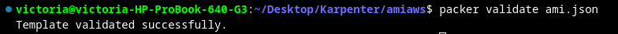
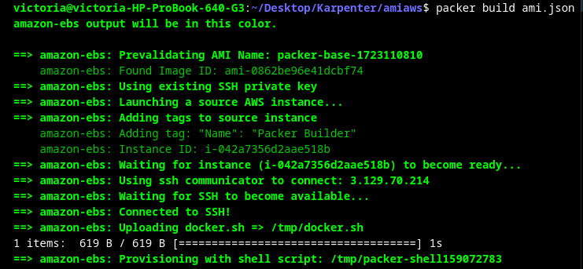
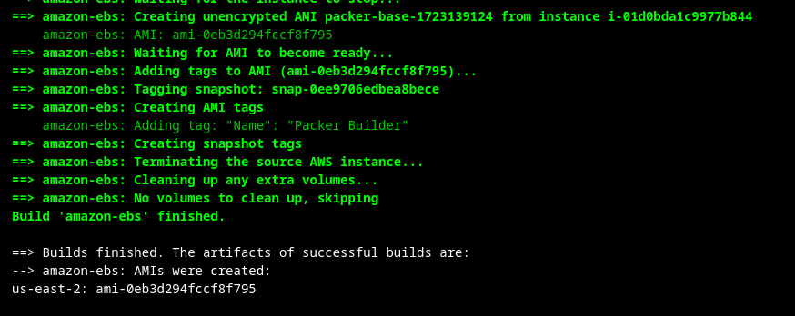
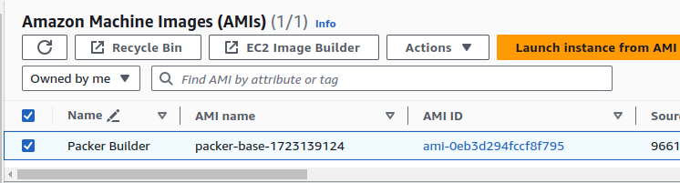
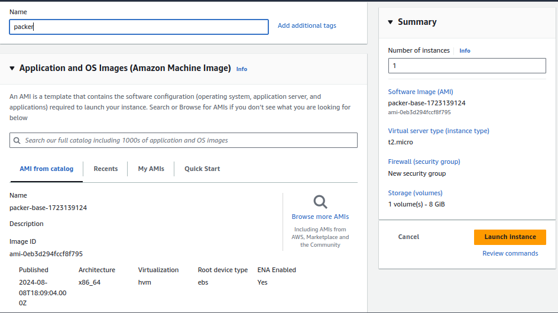
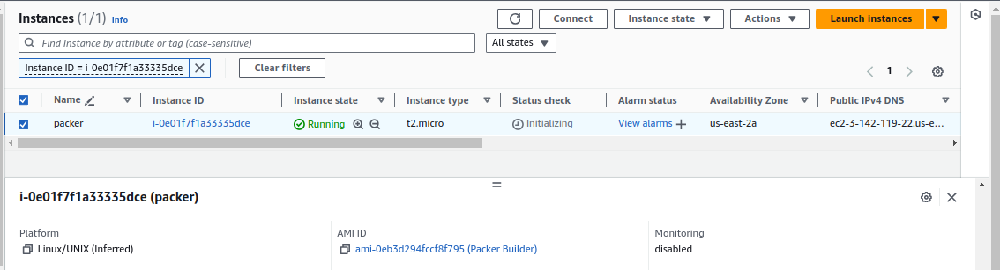

# Using HashiCorp Packer to create secured Amazon Machine Images.

## Table of Contents
- [Introduction](#introduction)
- [Getting started](#getting-started)
- [Clone the Repository](#clone-the-repo-and-cd-into-it-to-aceess-the-configuration-files)
- [Create JSON File for Configuration](#create-json-file-for-yor-file-configuration)
- [Export Your Variables](#export-your-variables)
- [Validate the Configuration File](#validate-the-configuration-file)
- [Execute the Configuration File](#execute-the-configuration-file)
- [Verify the AMI](#verify-the-ami)
- [Launch the Instance from This AMI](#launch-the-instance-from-this-ami)
- [Access Your Application in the Browser](#access-your-application-in-the-browser)

## Introduction
This guide will walk you through Using HashiCorp Packer to create secured Amazon Machine Images.

## Getting started

HashiCorp Packer is an open-source tool that allows you to create identical machine images for multiple platforms from a single source configuration. It’s lightweight, cross-platform, and highly efficient, enabling parallel image creation for different platforms.

## Clone the repo, and cd into it to aceess the configuration files
First, clone the repository containing the Packer configuration files, navigate into the directory, and copy the config files.

```bash
git remote add origin https://gitlab.com/<username>/ami.git
cd ami
```


## Create json file for yor file configuration.

- [ ] Create a json file for configuring all the parameters (variable, provisoners and builders) and paste the copied files into it. 
- [ ] To prevent SSH errors, it is advisable to use the ED25519 key type.

```bash
sudo nano ami.json
```
## Export your variables
- [ ] Run the below command in your terminal to export the AWS credentials
```bash
export AWS_ACCESS_KEY=<access_key>
export AWS_SECRET_ACCESS_KEY=<secret key>
export ACCOUNT_ID=<account_id>
```
- [ ] Run the below command in your terminal to export the Docker username and password to pull images.
```bash
export DOCKER_USERNAME=<docker_username>
export DOCKER_PASSWORD=<docker_password>
```

## Validate the configuration file
- [ ] After exporting variables, run the below command in order to validate the configuration file
```bash
packer validate ami.json 
``` 
- [ ] If the configuration file is valid then you should see the below output


## Execute the configuration file
- [ ] With the configuration validated, you can now build the AMI using the following command
```bash
packer build ami.json
```
- [ ] During the build process, Packer will output detailed logs, showing you the steps it’s taking. The output should look something like this


- [ ] Once the build is complete, Packer will confirm with a success message


## Verify the AMI
After the build process, navigate to the AMI section under EC2 in AWS console. You should see your newly created AMI listed there.


## Launch the instance from this AMI

You can launch the instance from this AMI to confirm our AMI is working
- [ ] In the AMI section, select the AMI you configured.
- [ ] Launch a new instance using this AMI.


- [ ] the AMI used here is the AMI we configured so there are no options for other AMI


- [ ] The instance created from the AMI is up and running successfully:


## Access Your Application in the Browser

- [ ] To confirm that your application is running, open your web browser, and input the public IP address of the instance together with the port. 
- [ ] Ensure that incoming traffic is allowed on the app's designated port within the security groups.
```bash
http://public_ip:port
```

- [ ] You should see your application’s interface, indicating that everything is functioning correctly


