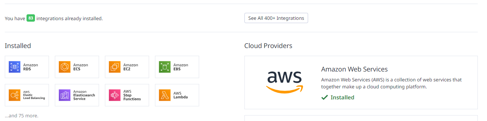
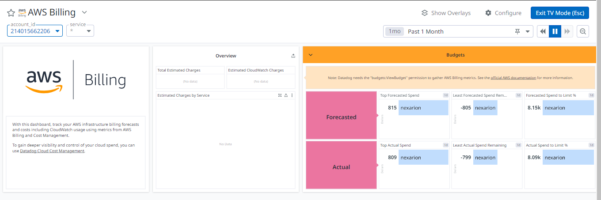
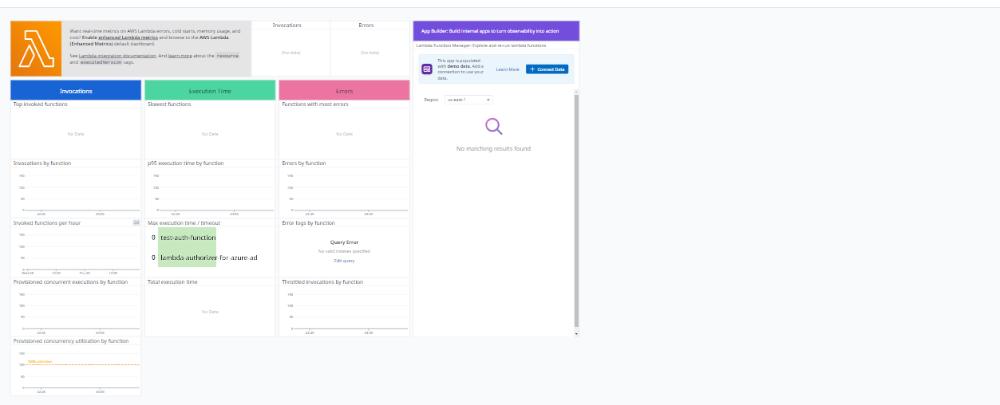

# Monitor AWS Resources using Datadog

Datadog is a cloud-based monitoring platform that helps organizations gain visibility into the performance of their applications and infrastructure. It collects and analyzes data from various sources, including servers, databases, networks, and custom metrics, providing insights into key performance indicators (KPIs) and identifying potential issues. Datadog's features include real-time monitoring, anomaly detection, alerting, and integration with popular technologies and tools, making it a valuable asset for DevOps teams and IT operations.

This repository, installs AWS integration on datadog. This allows you to have an overview and health of your AWS resources. The integration spans across multiple AWS services ranging from EC2 instances, RDS, Lambda, billing and cost, API gateway, EBS, ECS, S3, etc.

The integration also provides you with aws dashboards you can use to create your own custom dashboard to monitor your application and AWS resources health.

NOTE: The repository is designed to be used only locally. DO NOT PUSH YOUR API KEYS TO GITHUB

To use this repository, ensure that you meet the requirements listed below:

- Datadog Account
- AWS Account
- AWS credentials set up on your local machine
- Terraform Installed

## Set Up AWS Integration
In `terraform.tfvars` file, there are variable declarations to add your datadog API key and app key. Also ensure that you're using the correct api endpoint and datadog region in the endpoint URL.

Apply the terraform configuration using the command below:

```
terraform init
terraform validate
terraform apply --auto-approve
```

## Dashboards in DataDog

Once terraform applies successfully, you should have a list of integrations and dashboards available for you to monitor your AWS resources and even modify them too.



You can then proceed to explore these dashboards. In my demo AWS account, I didn't have any AWS services running but we can confirm that it works by exploring the billing dashboard in datadog. 

NOTE: Datadog takes some time to pull data from AWS.

Billing Dashboard:



Lambda Dashboard




