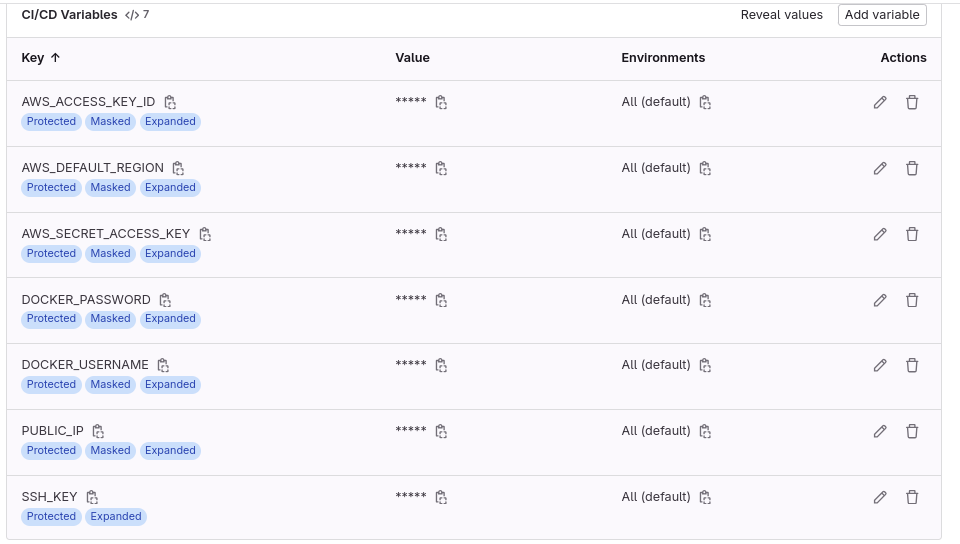
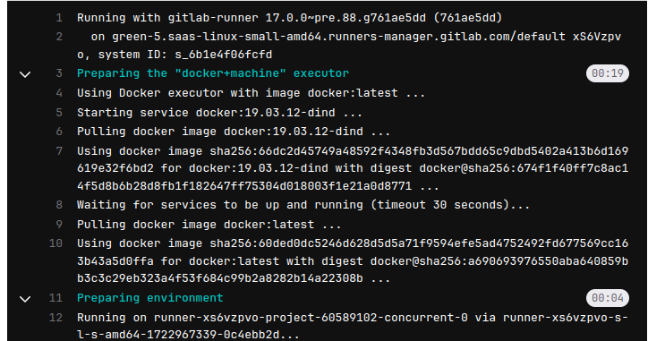
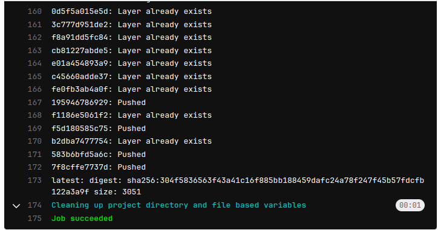
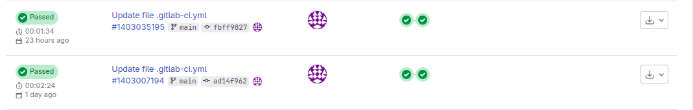

# Continuous Integration and Continuous Deployment of a NodeJS app using GitLab

## Table of Contents
1. [Introduction](#introduction)
2. [Getting Started?](#getting-started?)
3. [Set Environmental Variables](#set-environmental-variables)
4. [Configure Security Group in cloud provider](#configure security group in cloud provider)
4. [Run Your Pipeline](#run-your-pipeline)
5. [Verify Deployment on Cloud Provider](#verify-deployment-on-cloud-provider)
6. [Conclusion](#conclusion)

## Introduction
- [ ] GitLab CI/CD is a tool that helps you implement CI/CD pipelines for your projects.
- [ ] It provides a platform to define the steps involved in building, testing, and deploying your application.

## Getting Started?
Clone the repository and cd into the project folder:

```bash
git clone https://gitlab.com/<gitusername>/project.git
```
 Copy the folder into a new repository created and commit to GitLab:

```bash
   git commit -m "initial-commit"
   git push origin <branch>
```

## Set Environmental Variables
- [ ] To successfully deploy the project, you need to set environmental variables to allow GitLab to connect to your container registry and cloud provider.

- [ ] Navigate to the settings of your project, select CICD, and locate the variables section to set these environmental variables.


## Configure Security Group in Cloud Provider
- [ ] Configure your security group to allow incoming traffic on port 22 (for SSH access) and port 80 (for HTTP traffic).


## Run your Pipeline
- [ ] Once the variables are set, initiate the pipeline by modifying the .gitlab-ci.yml file to trigger the pipeline to run.

- [ ] If the pipeline is running, you will see the following in the pipeline details.


- [ ] If the pipeline completes successfully, you will see the following.






## Verify Deployment on Cloud Provider
- [ ] Log in to your cloud provider account to configure your security group to ensure that your security group allows incoming traffic on the app port to facilitate access to your containerized application.

- [ ] Retrieve your public IP from your EC2 instance and check for successful deployment in the browser using http://public-ip:port.
- [ ] If the app is successfully deployed on cloud provider, your browser should display the app.


