# Continuous Integration and Continuous Deployment of a NodeJS app using Jenkins

## Table of Contents
1. [Introduction](#introduction)
2. [Getting Started](#getting-started)
3. [Create credentials for your job](#create credentials for your job)
4. [Create a Jenkins Pipeline Job](#create-a-jenkins-pipeline-job)
5. [Configure the Pipeline Job](#configure-the-pipeline-job)
6. [Save and Build the Pipeline](#save-and-build-the-pipeline)

## Introduction
This guide will walk you through setting up a CI/CD pipeline using Jenkins for deploying a NodeJS application

- [ ] Jenkins is an open-source automation server that helps automate parts of the software development process, including building, testing, and deploying applications.
- [ ] It provides a platform to define the steps involved in building, testing, and deploying your application.

## Getting Started?
- [ ] Install and set up Jenkins to retrieve admin password from your terminal
```bash
# Update & upgrade system
sudo apt update
sudo apt upgrade -y

# Install Java
sudo apt install openjdk-11-jdk -y

# Add Jenkins repository
curl -fsSL https://pkg.jenkins.io/debian/jenkins.io.key | sudo tee \
  /usr/share/keyrings/jenkins-keyring.asc > /dev/null
echo deb [signed-by=/usr/share/keyrings/jenkins-keyring.asc] \
  https://pkg.jenkins.io/debian binary/ | sudo tee \
  /etc/apt/sources.list.d/jenkins.list > /dev/null

# Update package index
sudo apt update

# Install Jenkins
sudo apt install jenkins -y

# Start and enable Jenkins
sudo systemctl start jenkins
sudo systemctl enable jenkins
```
- [ ] To retrieve initial admin password, enter the folowing command on your terminal to generate the password which will be used for initial login
```bash
sudo cat /var/lib/jenkins/secrets/initialAdminPassword
```
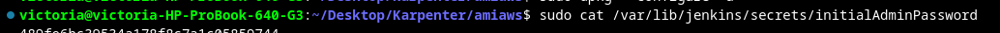


- [ ] Once the password is retrieved, Open your browser and navigate to http://localhost:8080 to log in to Jenkins.
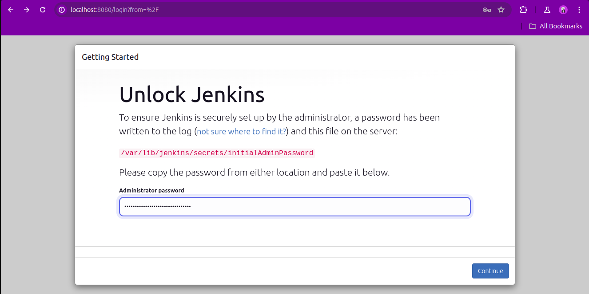


- [ ] After logging in, follow the setup wizard to install suggested plugins and configure your Jenkins environment.

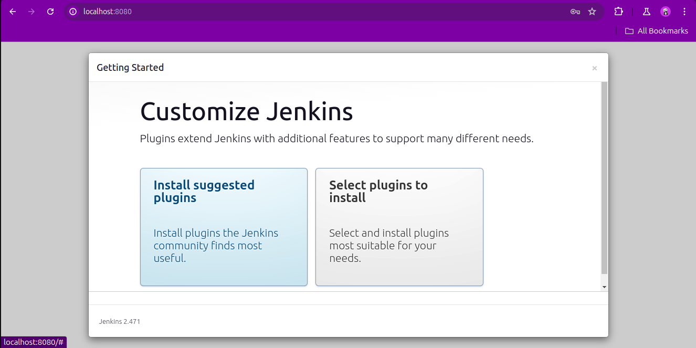
- [ ] Once the plugins have been installed, go ahead to create first admin user

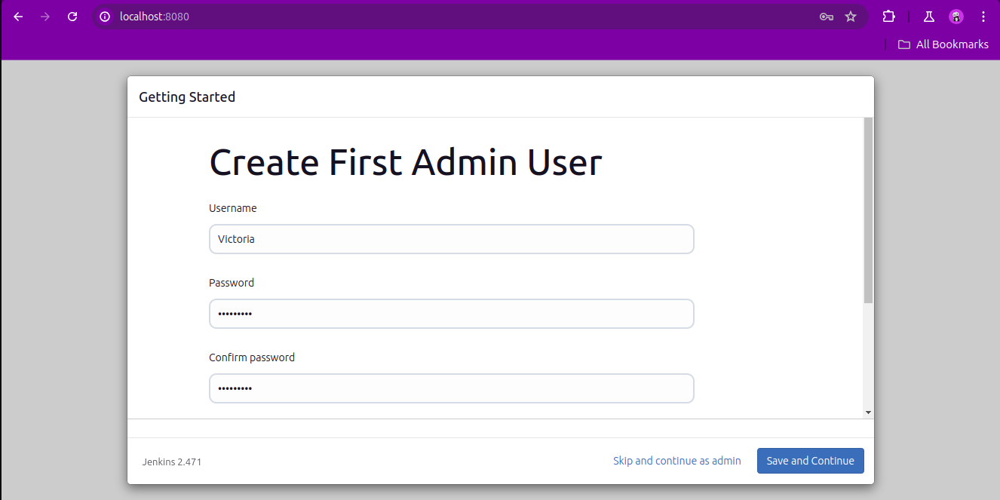

## create credentials for your job 
Navigate to manage Jenkins > credentials > system > global > create credntials to create credentials for your GitLab repository. (The username and password are your gitlab username and token)
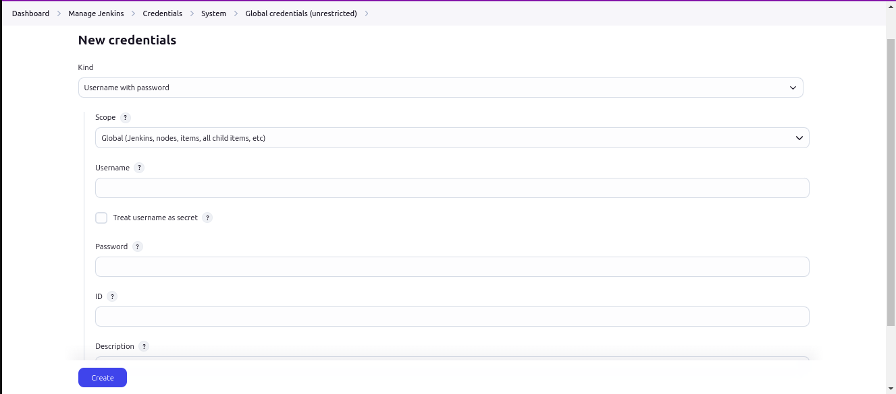

- [ ] After creating the credentials, go to manage Jenkins > plugins, and install NodeJS 

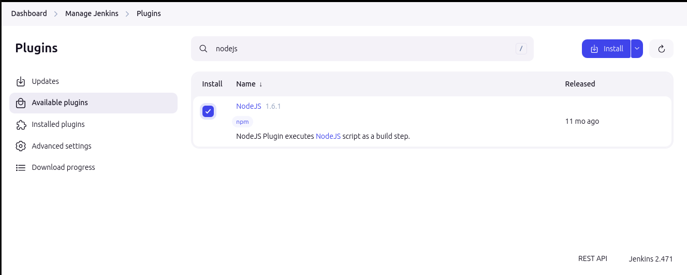

- [ ] Once the plugin is created, under manage Jenkins > tool, locate the NodeJS section. Add the NodeJS installation and ensure the name is correctly entered as NodeJS (case-sensitive).

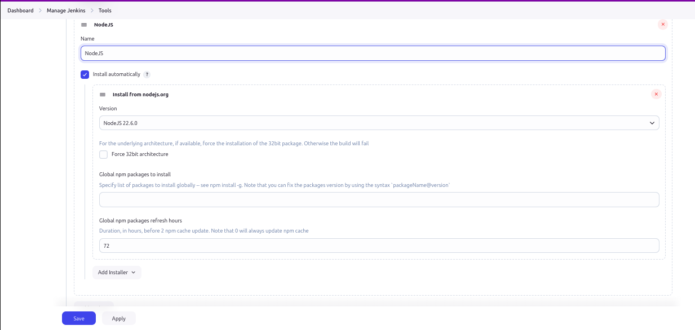

## Create a Jenkins Pipeline Job:
- [ ] Go to the Jenkins dashboard, click on New Item, enter a name for your job, select Multibranch Pipeline, and click OK.
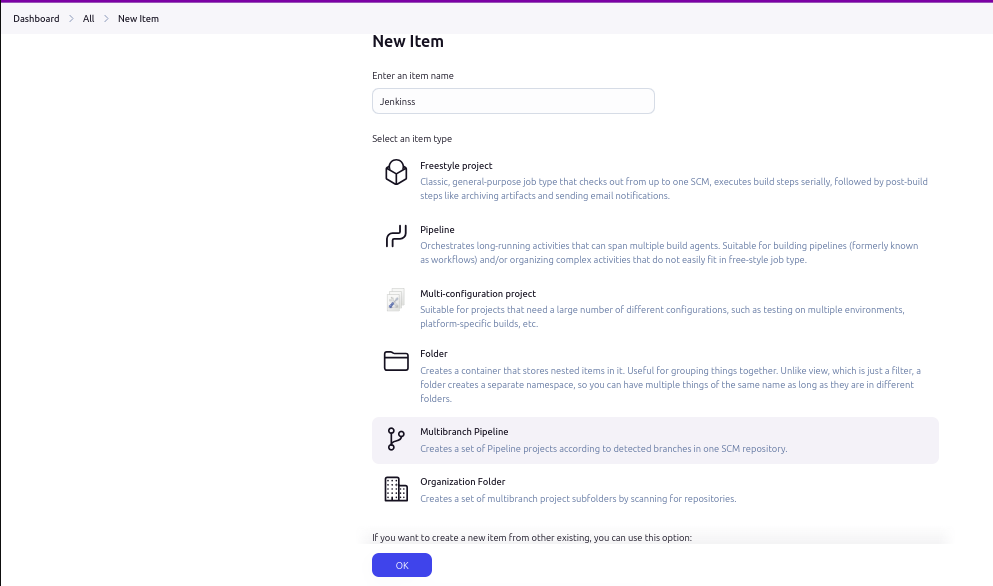


## Configure the Pipeline Job
- [ ] Click on your newly created pipeline job and navigate to the Configuration section.
- [ ] Enter a display name, select branch sources, and enter your GitLab repository URL.

```bash
https://gitlab.com/Oluwasanmi_Vic/project.git
```
- [ ] Under the Credentials section, select the credentials you previously created.

- [ ] Save the configuration to finalize the setup.

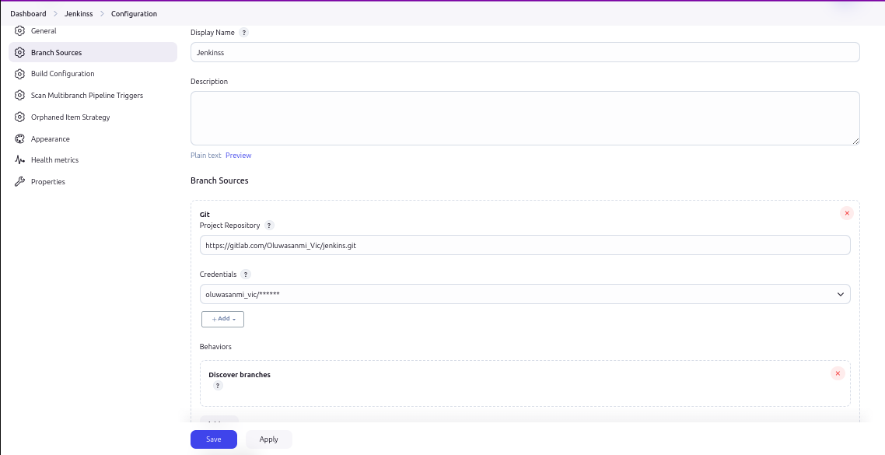

## Save and Build the Pipeline:

- [ ] After saving the pipeline configuration, click Build Now to trigger the pipeline execution.

- [ ] Wait for the build to complete. If successful, you should see logs and a confirmation indicating that the pipeline executed correctly.
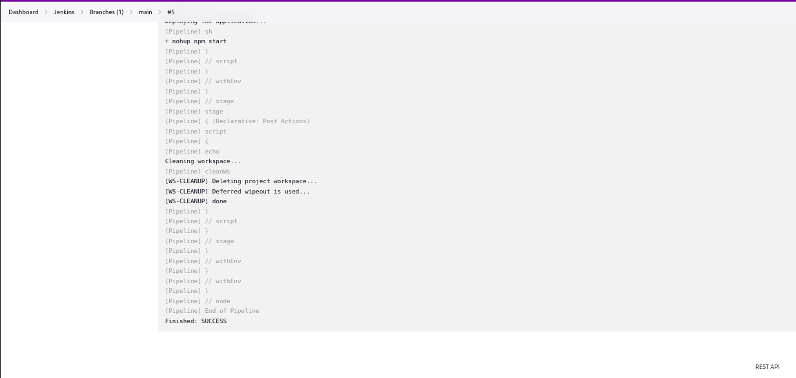

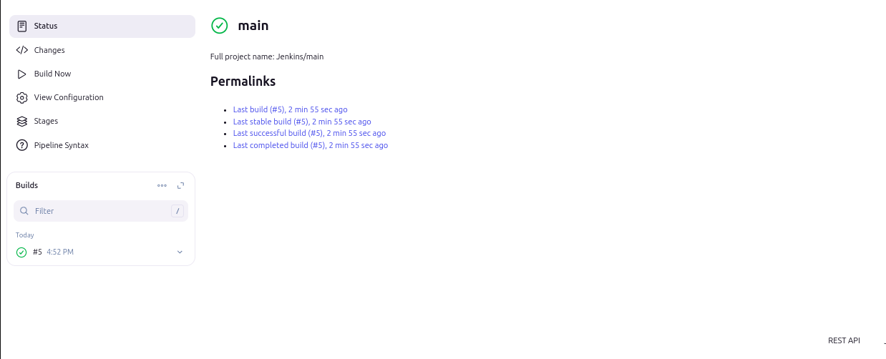