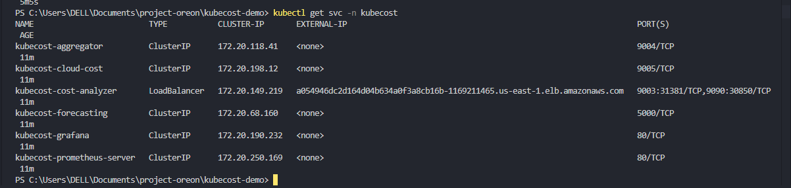
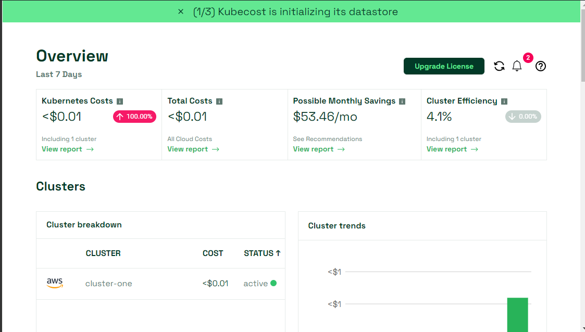
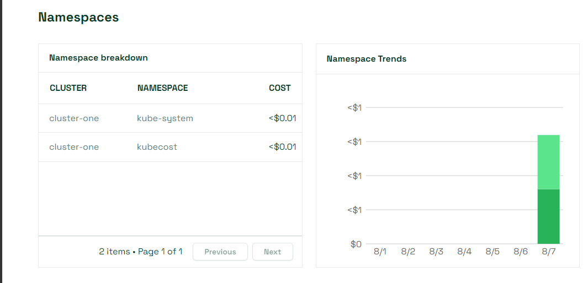
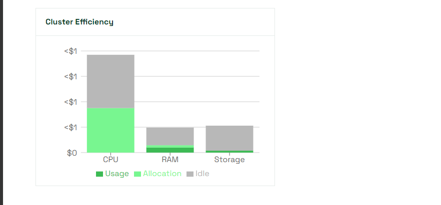
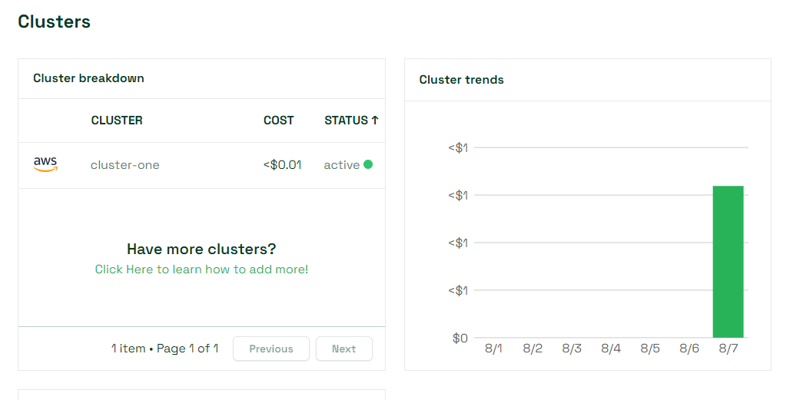

# Set Up Kubecost on EKS

Kubecost is an open-source tool designed to provide real-time visibility and insights into Kubernetes cluster costs. It makes predictions and provide real time insights of cluster costs using metrics fetched from prometheus. Think of Kubecost as your financial analyst for your Kubernetes cluster, helping you understand where your money is going and how to maximize your return on investment.

This repository, provisions a kubernetes cluster and installs kubecost on it. By leveraging infrastructure as code, this repository installs kubecost helm chart on the EKS cluster and exposes kubecost as a loadbalancer as the endpoint to access the UI.

## Using the Repository.

to use this repository, ensure that you have the requirements listed below:
    - AWS Account
    - Terraform Installed on Local machine
    - AWS CLI installed and configured on local machine.

Begin by initializing terraform

```
terraform init
```

Then validate the configuration to confirm it's valid
```
terraform validate
```

The repository is provided in such a way that when you apply the next command, it will provision the cluster, update the kubeconfig and install kubecost on the cluster.

```
terraform apply --auto-approve
```

It takes around 15-20mins to complete due to the nature of provisioning kubernetes clusters on AWS. 

## Accessing Kubecost
Once terraform completes apply process, you can proceed to access kubecost UI using the loadbalancer URL provided in kubecost service when you execute the command below

```
kubectl get svc -n kubecost
```

Copy the loadbalancer URL and access the UI on port 9090. for example us-east-1.elburl.com:9090

## ScreenShots










# Conclusion
